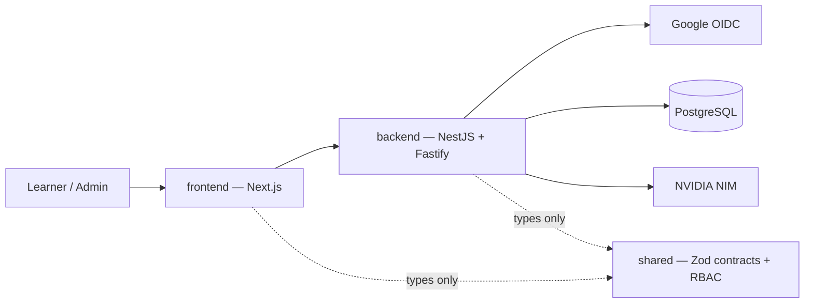

# Architecture



## Why three packages

`frontend` and `backend` never import from each other. Everything they must
agree on — request/response shapes, the DFD graph schema, the permission
table, AI output schemas — lives in `shared` and is enforced by the compiler on
both sides. Changing an endpoint's shape without updating the caller is a build
failure, not a runtime surprise.

## Security invariants

These are the properties the code is arranged to guarantee, each with the
mechanism that enforces it:

| Invariant | Mechanism |
|---|---|
| Answer keys never reach the browser before reveal | `CatalogService` Prisma `select` clauses cannot load them; `LabDetail` has no field for them |
| Reveal timing is the platform's decision | `AttemptsService` computes it from `attemptNumber`; `AiService` forces `shouldRevealAnswers: false` |
| Mitigation correctness is not AI-decided | Computed from `lab_threat_mitigations` before the AI call; the model's `isCorrect` is overwritten |
| The AI cannot invent answer keys | `restrictIds()` drops any id not supplied in the prompt |
| A NIM outage never loses work | The answer row is committed before any AI call |
| New endpoints are private by default | Global `SessionGuard`; a route is protected unless it carries `@Public()` |
| A client-supplied org id grants nothing | `accessFor()` resolves the caller's real membership; non-members get `orgRole: null` |
| Department managers cannot cross departments | `canInDepartment()` narrows every `limited` grant |
| The NIM key never reaches the browser | Only `NimClient` reads it; the frontend has no code path to NIM |

## Request lifecycle

1. `RequestContextInterceptor` assigns a request id and starts the timer.
2. `SessionGuard` resolves the session cookie into an `AuthContext` with real
   memberships, and enforces CSRF on mutations.
3. The controller validates the body against a `shared` Zod contract.
4. The service re-checks authorization against the resolved context, then acts.
5. `HttpExceptionFilter` renders any failure as the one error envelope.

## Step submission flow

```
POST /attempts/:id/steps/threats
  ├─ loadForWrite        owner check, attempt still in progress
  ├─ assertStepAllowed   cannot skip ahead; re-submitting the current step is the retry path
  ├─ recordSubmission    ANSWER COMMITTED HERE — before any AI call
  ├─ AiService           NIM call; failure returns status "unavailable", never throws
  ├─ restrictIds         drop hallucinated canonical ids
  ├─ platform decides    reveal after THREAT_RETRY_LIMIT, not on the model's say-so
  └─ finish              persist feedback, advance the step
```

## Known gaps

Documented in the README and the handover notes: no BullMQ workers, no
OpenTelemetry export, no pgvector semantic matching (aliases plus the model's
own semantic matching cover it today), and no Playwright suite. None of these
change the interfaces above.
